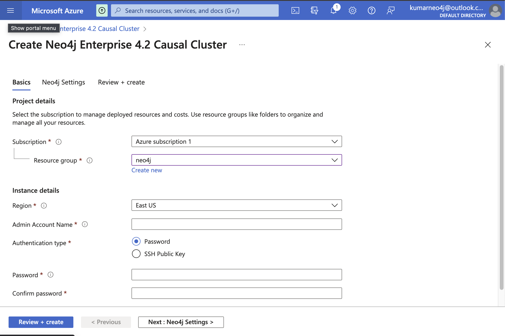
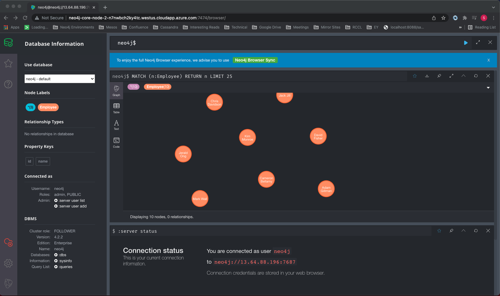
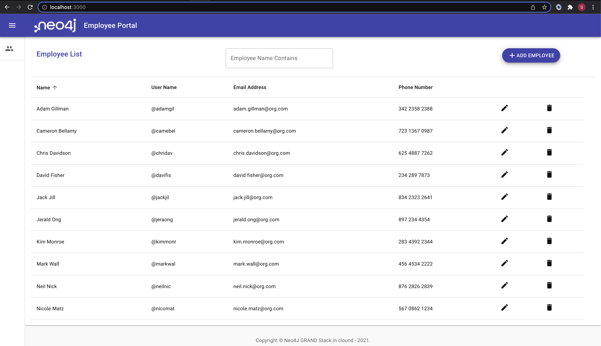
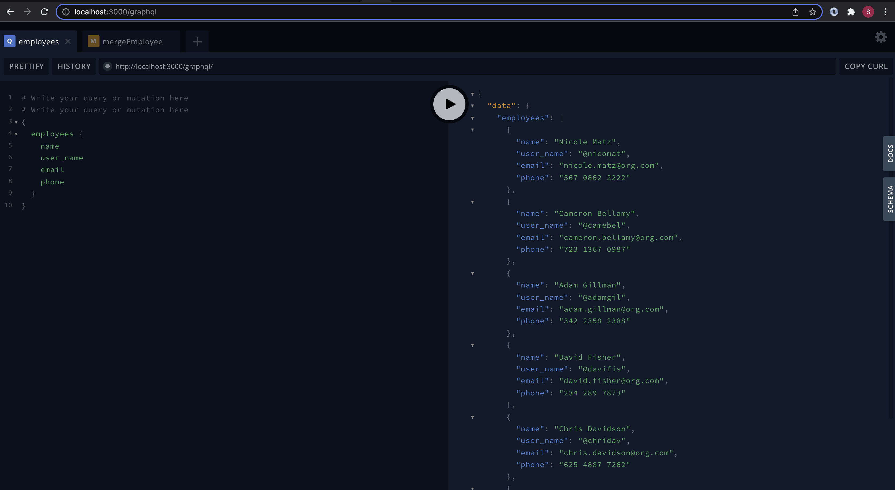

# Neo4j & GRANDStack

Welcome to GRANDStack sample, This code demonstrates the development of end to end neo4j pipeline which includes setting up db, creating api, connecting to ui and deploy the app to cloud

This project is a built from [GRANDstack](https://grandstack.io)(GraphQL, React, Apollo, Neo4j Database) starter template, There are two components, the web frontend application in ReactJS and the API app (GraphQL server).

This project represents a **Employee List with CRUD operations on employee**.

## Installation Guide

### 1. Create A Neo4j Instance

There are variety of ways to spin up a neo4j instance  

1. For on-prem, you coud use neo4j desktop, or install neo4j as service in a VM
2. For cloud, you coud use native Neo4j Aura cloud, or other cloud vendors like Azure, AWS, GCP etc.

For this exercise, Neo4J causal cluster has been hosted in Azure  


Access Neo4J DB from browser


### 2. Clone the repo and start the app

```
git clone https://github.com/kumarss20/neo4j-exercise.git
npm install
npm start run
```

(If you have a running Neo4j database on localhost via Neo4j Desktop or a Neo4j server installation, change the password in `api/.env`)

### 3. Open the UI in browser



The initial launch of UI may not have any employees in the list, you could add employees using Add Employee button in the top right of the screen

## <a name="overview"></a> Overview

This is monorepo that includes a GraphQL API application and client web applications for React for employee list with CRUD operations.
to list the employee and do CRUD operations on employee node on the graph

### `/` - Project Root

The root directory contains some global configuration and scripts:

- `npm run start` and `npm run build`
- ESLint (.eslintrc.json) for code linting
- Prettier (.prettierrc.json) for code formatting
- Git hooks for applying formatting on commit

### [`/api`](./api)



This directory contains the GraphQL API application using Apollo Server and the Neo4j GraphQL Library.

#### CRUD operations with graphql API  

##### List Employees

Graphql `type` for Employee allows us to query the employees, it also creates additional autogenerated code for filter, sort, limit and skip which can paremeters for search

```
type Employee {
  name: String
  user_name: ID!
  email: String
  phone: String
}
```

##### Create Employee

Graphql `mutation` allows us to do create or update operations, Below mergeEmployee takes care of both create and update of employee node in the graph

```
  mergeEmployee(name: String!, user_name: ID!, email: String, phone: String): Employee
    @cypher(
      statement: """
      MERGE (e:Employee {user_name: $user_name})
      SET e.name = $name,
          e.email = $email,
          e.phone = $phone
      RETURN e
      """
    )
```

##### Delete Employee

```
  deleteEmployee(user_name: ID!): String
    @cypher(
      statement: """
      MATCH (e:Employee {user_name: toString($user_name)})
      DETACH DELETE e
      RETURN 'Successfully deleted' as message
      """
    )
```

##### Full Text Search  

This capability can be enabled in neo4j by running below cypher

```
CALL db.index.fulltext.createNodeIndex("employeeFTI",["Employee"],["name", "user_name", "email","phone"])
```

Incorporate fulltext search in graphql query as below

```
type Query {
  searchEmpoyee(term:String!):[Employee]
    @cypher(
      statement: """
      CALL db.index.fulltext.queryNodes('employeeFTI', $term) YIELD node, score
      RETURN node
      """
    )
}
```

- Change environment variable settings in `.env`:

```
# Use this file to set environment variables with credentials and configuration options
# This file is provided as an example and should be replaced with your own values
# You probably don't want to check this into version control!

NEO4J_URI=bolt://localhost:7687
NEO4J_USER=neo4j
NEO4J_PASSWORD=letmein

# Uncomment this line to enable encrypted driver connection for Neo4j
#NEO4J_ENCRYPTED=true

# Uncomment this line to specify a specific Neo4j database (v4.x+ only)
#NEO4J_DATABASE=neo4j

GRAPHQL_SERVER_HOST=0.0.0.0
GRAPHQL_SERVER_PORT=4001
GRAPHQL_SERVER_PATH=/graphql

```

### [`/web-react`](./web-react)


The frontend React web application is found in this directory.

It includes:

- Material UI
- React router
- Apollo Client / React Hooks
- Create React App

## Deployment

### Netlify

This monorepo can be deployed to Netlify. The frontend application will be served over Netlify's CDN and the GraphQL API will be provisioned as a serverless GraphQL API lambda function deployed to AWS (via Netlify). A netlify.toml file is included with the necessary build configurations. The following environment variables must be set in Netlify (either via the Netlify web UI or via the command line tool)

```
NEO4J_URI
NEO4J_USER
NEO4J_PASSWORD
```

Instructions on deploying react app in netlify can be found [here](https://www.netlify.com/blog/2016/07/22/deploy-react-apps-in-less-than-30-seconds/)
